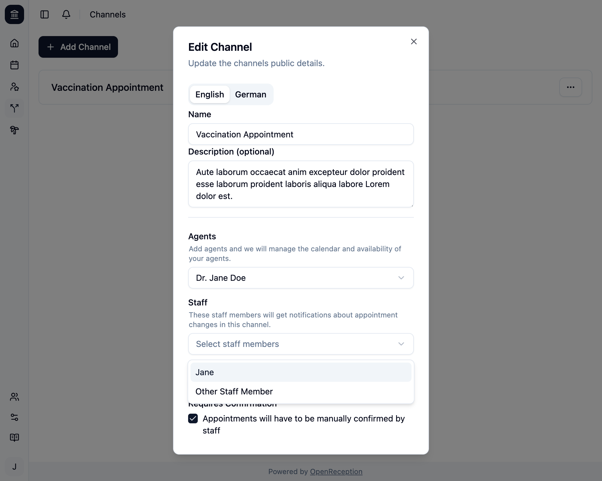
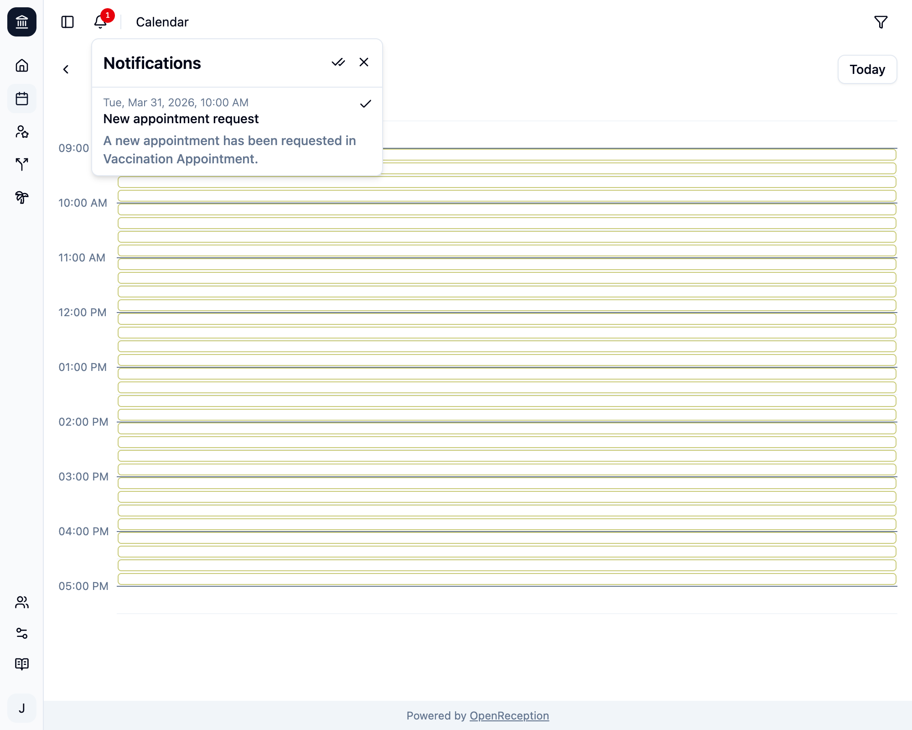

The OpenReception notification system makes sure staff members are informed, if a client requests an appointment or appointments are cancelled.

Only staff members get notifications.

Notifications only exist within the OpenReception dashboard.

## Subscribe to Notifications

To get notifications you have to add the respective staff member to the [channel](/channels).

## Notification Badge

If you have notifications, a red badge will appear next to the bell-icon in the top left area of the dashboard page.

Clicking the bell-icon, will open the notification list.

- You can remove single notifications by clicking the checkmark icon at the right of the notification.
- You can remove all notifications by clicking the double-checkmark icon.
- You can close the notification list by clicking the cross icon.

Some notifications allow you to click on them. You will be led to the respective page or appointment.
