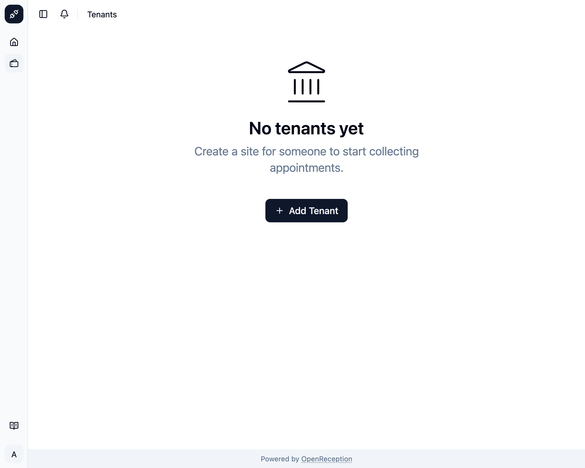
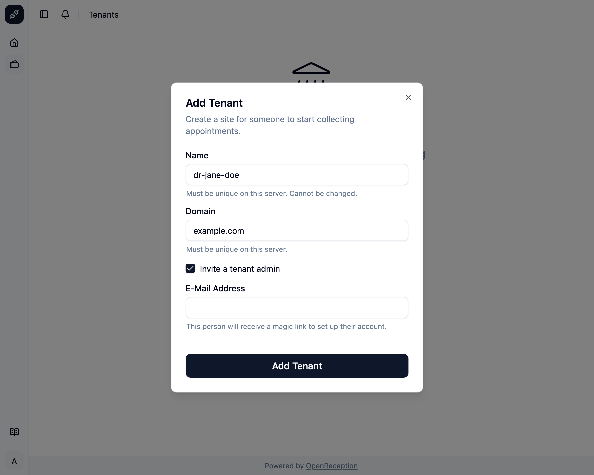
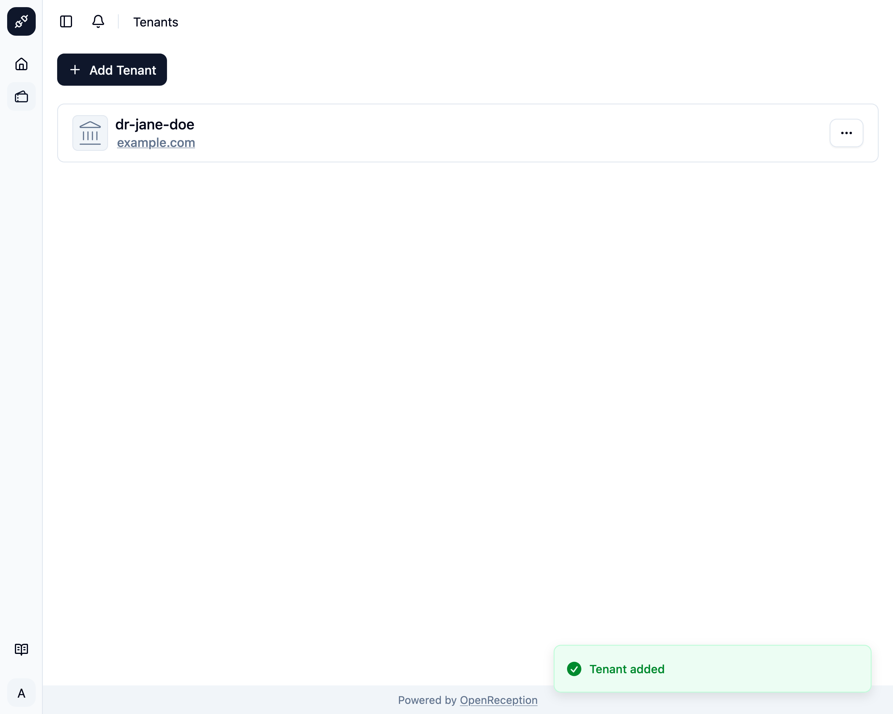

import {Steps} from "@astrojs/starlight/components";
import {Badge} from "@astrojs/starlight/components";

<Badge text="Management Feature" />
Add a new tenant, if you want to allow a new organization/ person to collect
appointments.

<Steps>

1. Navigate to the tenant section of the dashboard and click on _Add Tenant_

   

1. A modal with a form opens.
   - Add a unique internal **name** for the tenant. Cannot be changed later.
   - Add a **domain**. This domain should already point to the IP or CNAME of this instance.
   - You can also add an **E-Mail Address** for a person that will be added with the [tenant admin role](../staff#roles).
   - Click _Add Tenant_ when you are finished.

   

1. The tenant will be created and shown in the list of tenants.

   

</Steps>

Proceed with selecting the tenant, to start setting it up.
