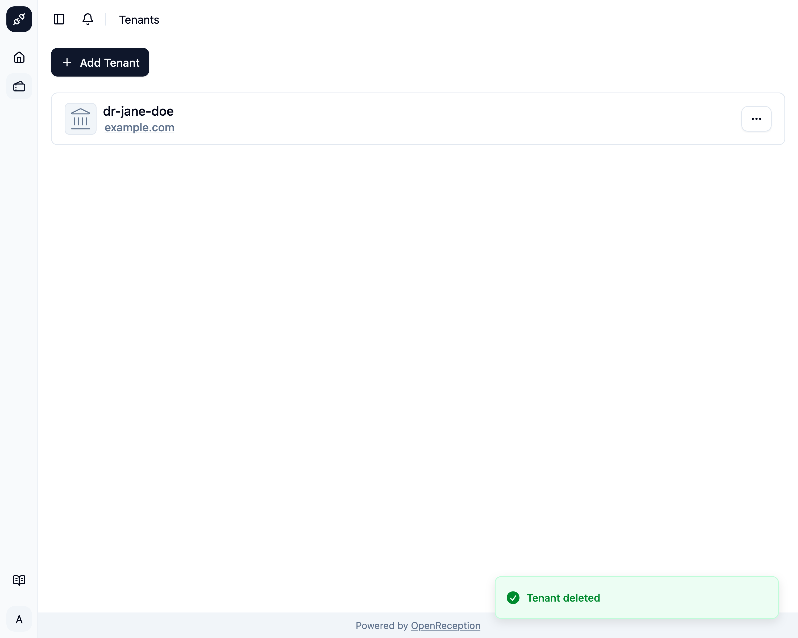

import {Steps} from "@astrojs/starlight/components";
import {Badge} from "@astrojs/starlight/components";

<Badge text="Management Feature" />
If you don't need a tenant anymore, you can delete it.

:::danger
Deleting a tenant will remove all configurations and appointments. This cannot be undone.
:::

:::caution
You cannot delete a tenant, that you have currently selected. Select another tenant first.
:::

<Steps>

1. Navigate to the tenant section of the dashboard, search for the tenant you want to delete and open the context menu for it. Click on _Delete_.

   

1. A modal with a form opens. Enter the name of the tenant and click _Delete Tenant_

   

1. The tenant will be deleted and removed from the list.

   

</Steps>
