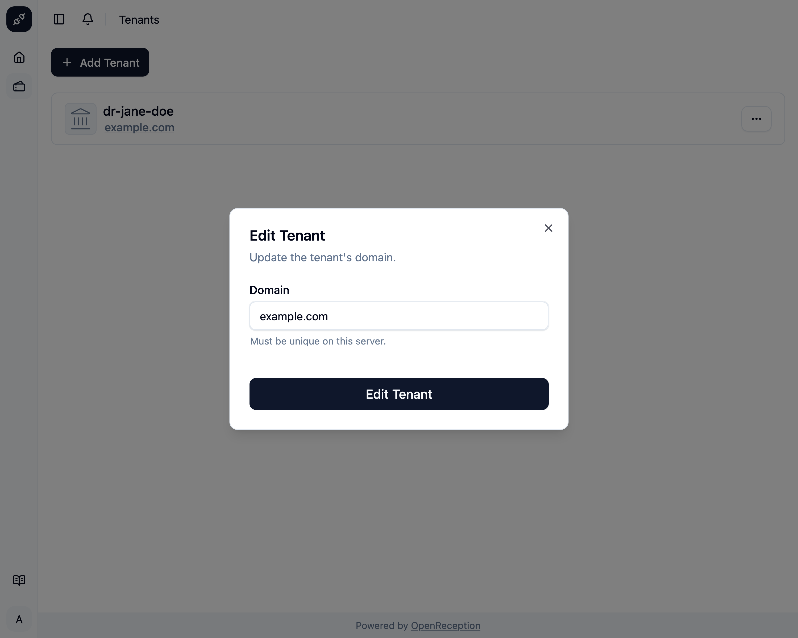
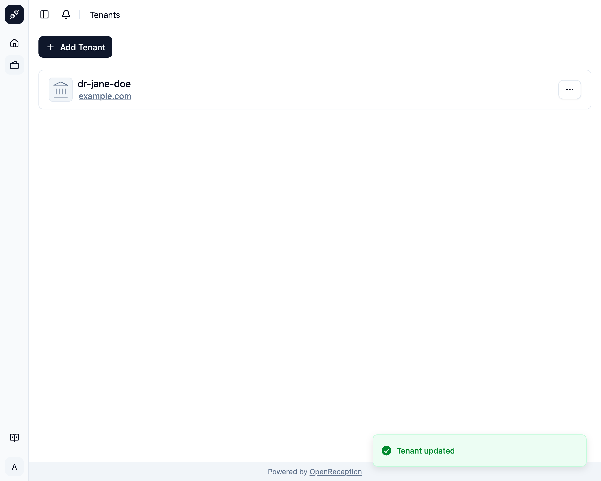

import {Steps} from "@astrojs/starlight/components";
import {Badge} from "@astrojs/starlight/components";

<Badge text="Management Feature" />
Editing a tenant is very limited as of now.

<Steps>

1. Navigate to the tenant section of the dashboard, search for the tenant you want to edit and open the context menu for it. Click on _Edit_.

   

1. A modal with a form opens.
   - Edit the **domain**. The new domain should already point to the IP or CNAME of this instance. If this is not the case, the appointment website for this tenant will be unavailable.
   - Click _Edit Tenant_ when you are finished.

   

1. The tenant will be updated.

   

</Steps>
