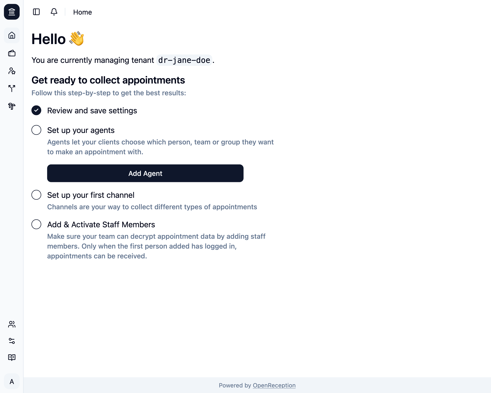

import {Badge} from "@astrojs/starlight/components";
import {Steps} from "@astrojs/starlight/components";

<Badge text="Management Feature" />
If the configuration is incomplete OpenReception will let you know on the
Dashboard. It's recommended that you work your way through it from the top to
the bottom, as some of these configurations build on each other. Just click on
the shown button and enter the details in the presented form.

When you have saved that form and the onboarding is still not complete, you will see a blue notification, that brings you back to the dashboard, so you can proceed the onboarding from there.

On the dashboard you will always see the current state of your setup progress.

