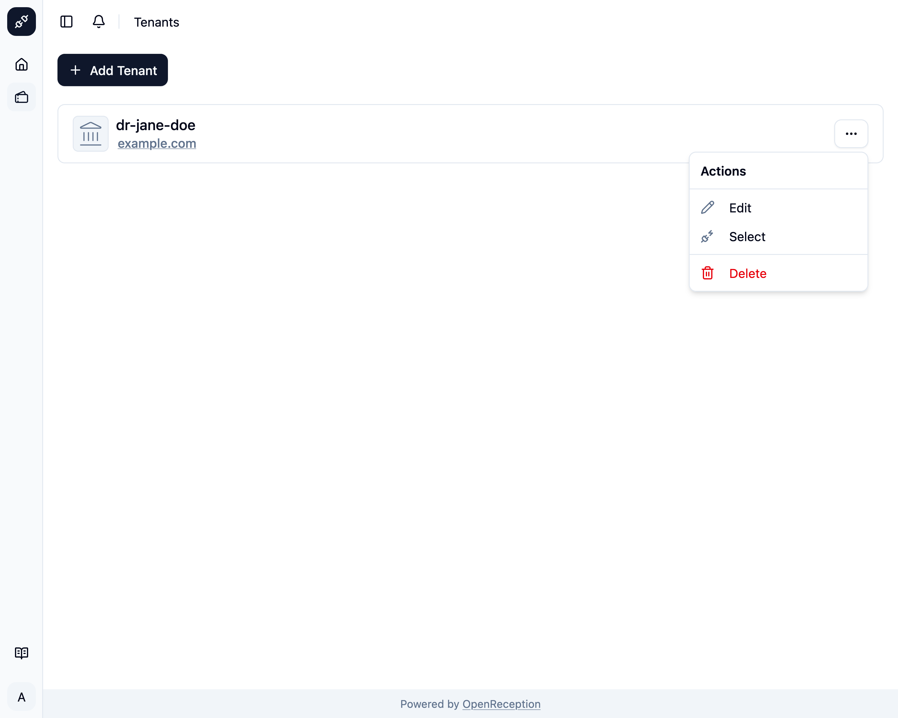
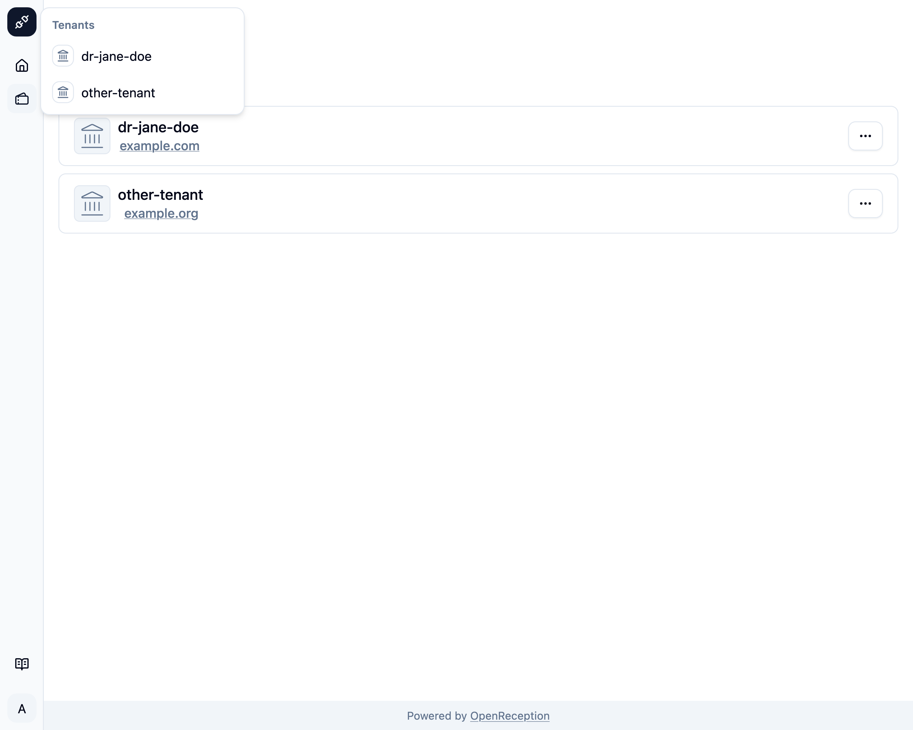

import {Badge} from "@astrojs/starlight/components";
import {Steps} from "@astrojs/starlight/components";

<Badge text="Management Feature" />
Selecting a tenant is your way as a Global Admin to switch between tenants.

<Steps>

1. Navigate to the tenant section of the dashboard, search for the tenant you want to select and open the context menu for it. Click on _Select_.

   

1. Once the selection is complete, you are forwarded to the dashboard for this tenant. In this case it's a fresh tenant, that still needs to be set up. It's an [onboarding guide to help you get this tenant ready](../onboarding-a-tenant).

   

</Steps>

You can also select tenants from the top left selection, if you have more than one.

